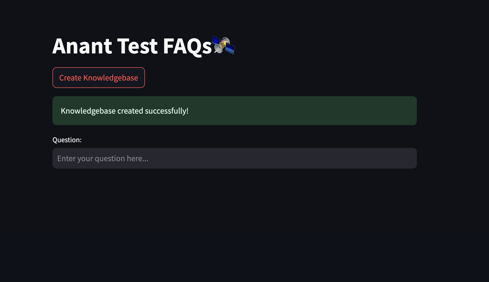
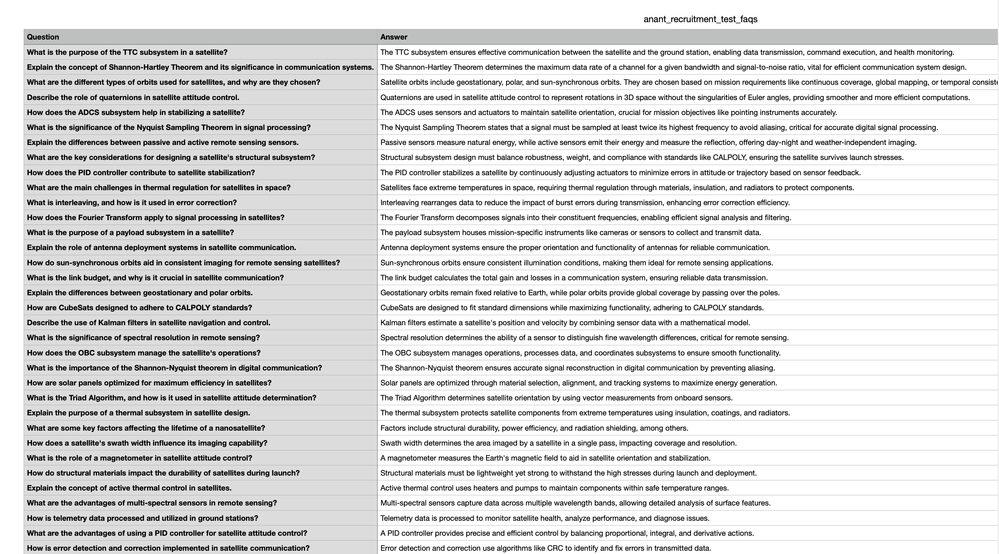
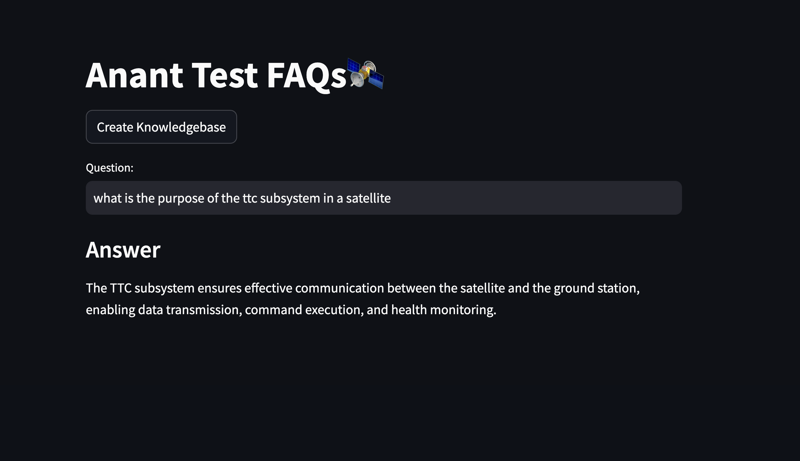

# Question and Answer System Based on Google Palm LLM and Langchain for E-learning company  



This is the main interface of the application, allowing users to create a knowledge base and ask questions interactively.



The application uses structured FAQs like the ones above to build its knowledge base.



The application fetches relevant answers in real time using LangChain and FAISS.

  - Langchain + Google Palm: LLM based Q&A
  - Streamlit: UI
  - Huggingface instructor embeddings: Text embeddings
  - FAISS: Vector databse

## Installation

1.Clone this repository to your local machine using:

```bash
  git clone https://github.com/codebasics/langchain.git
```
2.Navigate to the project directory:

```bash
  cd 3_project_codebasics_q_and_a
```
3. Install the required dependencies using pip:

```bash
  pip install -r requirements.txt
```
4.Acquire an api key through makersuite.google.com and put it in .env file

```bash
  GOOGLE_API_KEY="your_api_key_here"
```


## Project Structure

- main.py: The main Streamlit application script.
- langchain_helper.py: This has all the langchain code
- requirements.txt: A list of required Python packages for the project.
- .env: Configuration file for storing your Google API key.
